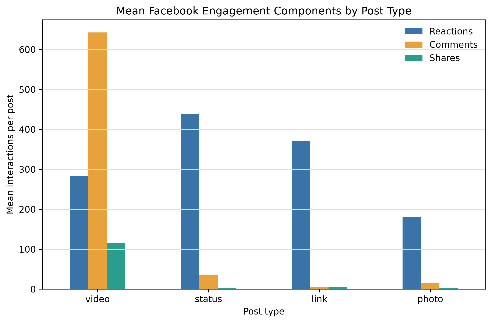
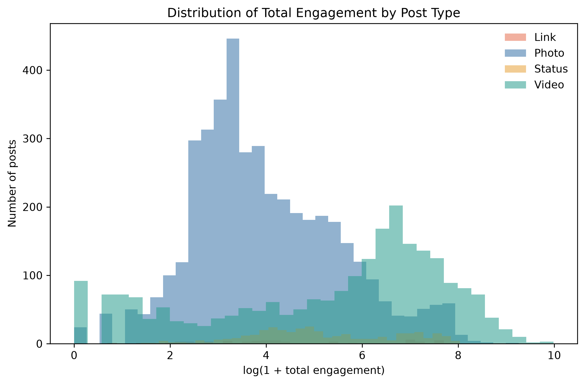
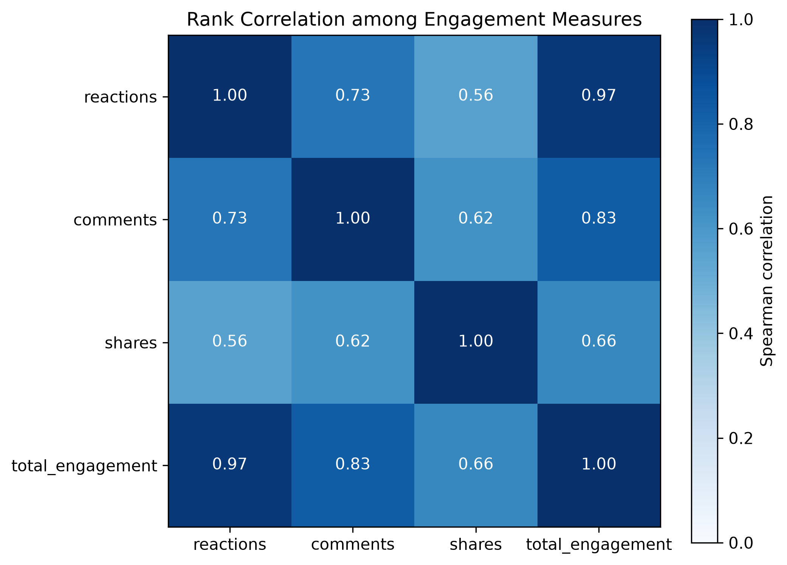
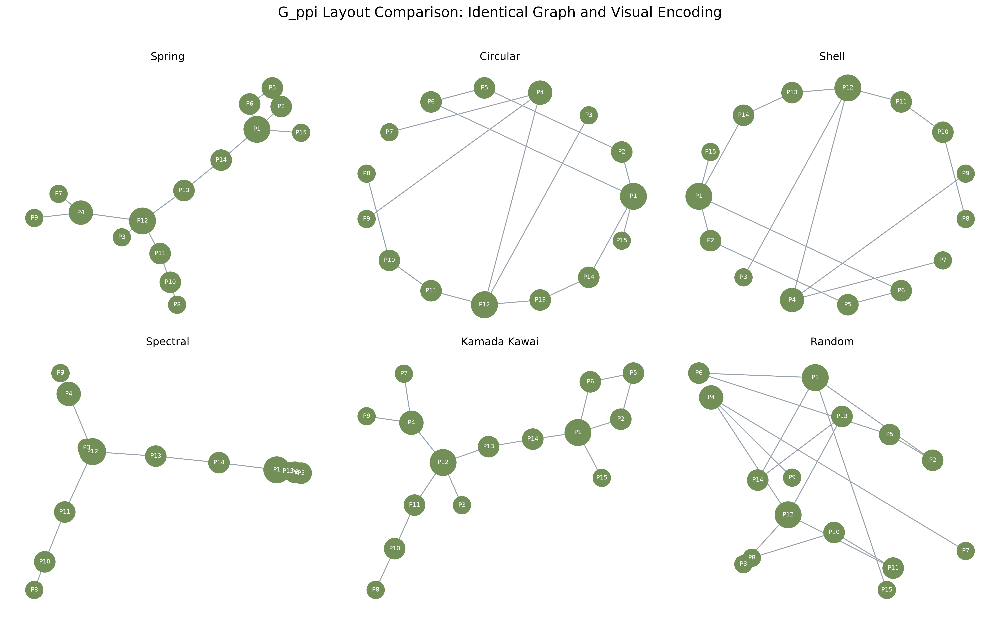
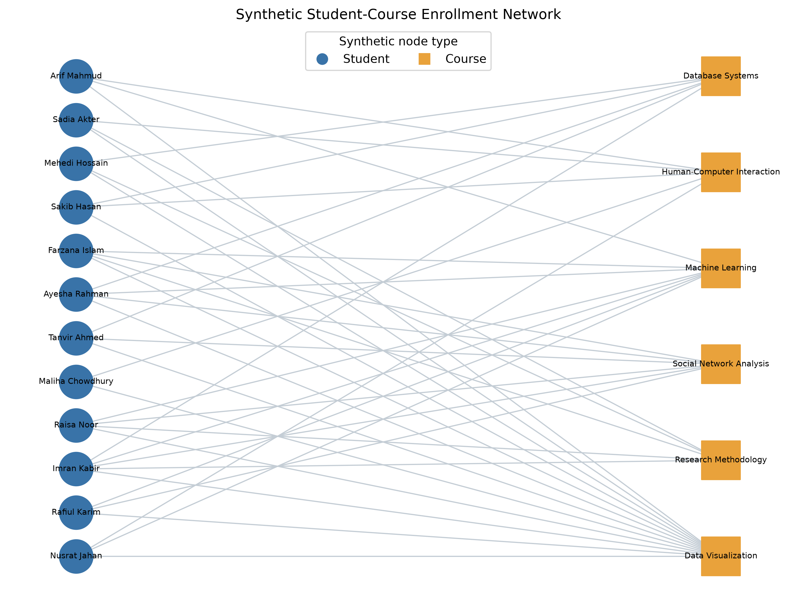
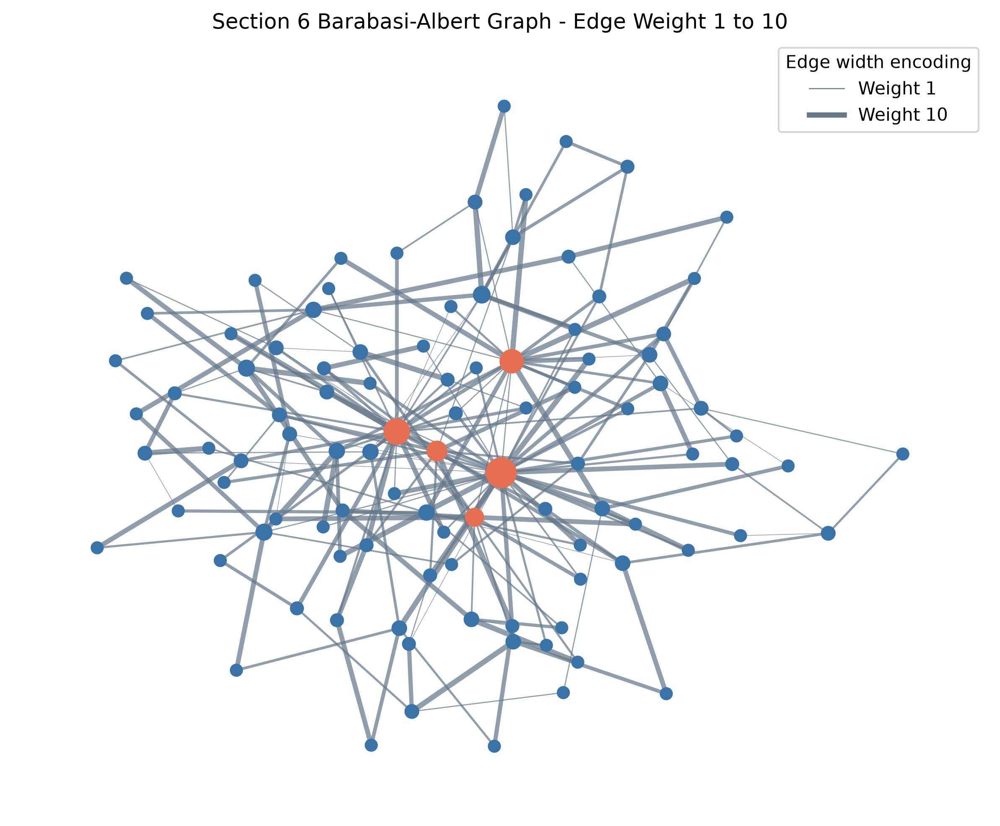
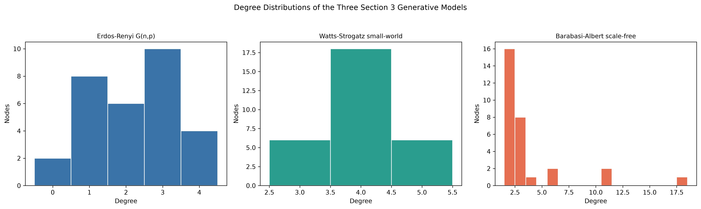
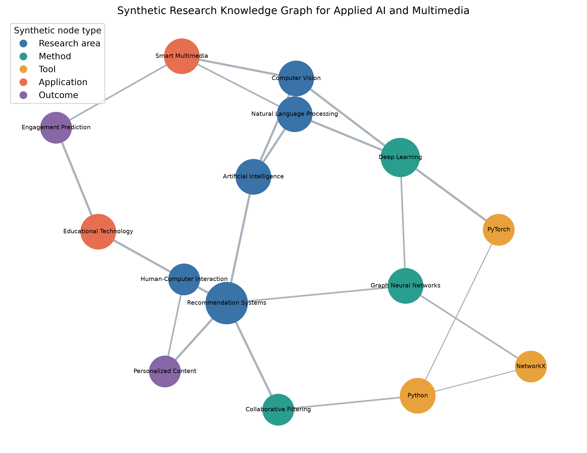

# Visual Analytics and Network Analysis of Facebook Engagement Using Python

**Student:** S. M. Monowar Kayser  
**Student ID:** 253-25-019  
**Course:** Data Visualization (CSE628)  
**Semester:** Summer 2026  
**Teacher:** Sadat Hasan, Adjunct Faculty  
**Department:** Department of Computer Science and Engineering  
**University:** Daffodil International University

## Abstract

This project analyzes 7,050 anonymized Facebook posts from ten Thai fashion and cosmetics sellers and extends the supplied graph-visualization teaching material through seven reproducible exercises. The analysis combines data cleaning, feature engineering, exploratory visualization, graph representations, layout comparison, bipartite modeling, weighted encoding, generative-model statistics, and interactive Plotly networks. The dataset records 1,622,326 reactions, 1,581,710 comments, and 282,159 shares. Video posts have the largest mean total engagement (1,041.57), although the observational design does not support a causal claim. The weighted `G_transport` adjacency matrix is symmetric, while the model comparison shows a trade-off: Watts-Strogatz captures clustering and short paths, whereas Barabasi-Albert captures hubs and degree heterogeneity. The result is a reproducible academic artifact with static figures, interactive HTML, executable notebooks, a responsive website, automated tests, and machine-readable analytical outputs.

**Keywords:** Facebook engagement, data visualization, social-network analysis, NetworkX, Plotly, graph layout, Python

## 1. Introduction

Social-media engagement is multidimensional: lightweight reactions coexist with comments and shares that may require greater effort. A responsible visual analysis must therefore preserve individual measures while also making aggregate patterns legible. This study addresses two linked tasks. First, it describes post-level engagement in an anonymized, publicly licensed Facebook dataset. Second, it applies and extends the graph concepts in the supplied course notebook so that representations, layouts, weights, centrality, and interaction can be compared using reproducible evidence.

### 1.1 Problem statement

Raw engagement counts are highly skewed, post categories are imbalanced, and a tabular engagement dataset does not contain verified user-to-user relationships. Treating rows as a social network would invent edges. The project therefore keeps the empirical Facebook analysis tabular and labels the assignment's relationship graphs as synthetic.

### 1.2 Objectives

1. Construct a reproducible cleaning and feature-engineering workflow.
2. Describe engagement differences across post type and time without causal overreach.
3. Complete all seven mandatory graph exercises using the supplied graph definitions.
4. Compare static and interactive visual encodings.
5. publish auditable outputs through documentation, tests, a report, and a responsive dashboard.

### 1.3 Research questions

1. How do reactions, comments, shares, and total engagement vary across post types?
2. Which temporal patterns are visible in posting activity and median engagement?
3. How do graph layout and edge-weight encodings change structural interpretation?
4. Which canonical generative model reproduces particular social-network properties?
5. Which nodes occupy structurally important positions in the synthetic research graph?

## 2. Dataset and provenance

The dataset is **Facebook Live Sellers in Thailand**, authored by Nassim Dehouche and distributed by the UCI Machine Learning Repository under CC BY 4.0 [1]. The raw CSV contains 7,050 rows and 16 columns; four columns are entirely empty placeholders. Posts span 2012-07-15 through 2018-06-13. The official UCI file was used because Kaggle credentials were not configured; a Kaggle mirror is documented but was not used for acquisition. The original study reports anonymized data collected from ten Thai fashion and cosmetics seller pages [2].

The selection is appropriate because it is medium-sized, includes numerical and categorical engagement variables, contains timestamps, is publicly licensed, and contains no names or message text. Its limitation is equally important: it does not contain reach, impressions, follower counts, page identity, or user-to-user interaction IDs.

## 3. Tools and reproducibility

Python is the primary language. Pandas performs data preparation, NumPy supports numerical operations, NetworkX constructs and measures graphs, Matplotlib creates 300-DPI static figures, Plotly produces standalone interactive HTML, SciPy supports NetworkX's Kamada-Kawai layout path, python-docx creates the editable report, ReportLab provides a PDF fallback, nbformat creates notebooks, and pytest validates the workflow. Fixed seed 42 controls every stochastic graph and layout where the API accepts a seed.

## 4. Data-cleaning methodology

The raw file was preserved unchanged. Column names were standardized; 4 entirely empty columns were removed; numeric engagement fields were coerced, checked for nonnegative values, and stored as integers; timestamps were parsed; categories were normalized; and duplicates were checked by full row and `status_id`. The pipeline removed 0 duplicate rows and 0 duplicate IDs. It removed 0 invalid timestamps and imputed 0 missing numeric values. The final analytical table contains 7,050 rows and 27 columns.

Outliers are flagged, not deleted, using the upper Tukey fence on total engagement (1,019.00); 972 posts exceed the threshold. This preserves genuine high-performing posts while making skew explicit.

## 5. Feature engineering

- **Total engagement** = reactions + comments + shares.
- **Like-to-comment ratio** = likes / comments, with zero returned when comments are zero.
- **Share-to-engagement ratio** = shares / total engagement, with zero-safe division.
- **Positive reaction percentage** = (likes + loves + wows) / sum of recorded reaction components × 100.
- **Negative reaction percentage** = (sads + angrys) / sum of recorded reaction components × 100.
- **Temporal features** include posting hour, weekday, month, ISO week, weekend flag, and time-of-day band.
- **Engagement category** assigns low, medium, and high groups by rank-based tertiles.

No engagement-rate feature is claimed because reach or impressions are absent.

## 6. Exploratory data analysis

The dataset contains 4,288 photos, 2,334 videos, 365 status posts, and 63 links. Total engagement is 3,486,195; its mean is 494.50 and median is 69.00, demonstrating right skew. The hour with the largest observed median engagement is 18:00 (377.00), but this association may reflect content mix, seller behavior, seasonality, or other unobserved factors.

**Table 1. Engagement summary by post type**

| Post type | Posts | Mean reactions | Mean comments | Mean shares | Mean total engagement |
|---|---:|---:|---:|---:|---:|
| Video | 2,334 | 283.41 | 642.48 | 115.68 | 1,041.57 |
| Status | 365 | 438.78 | 36.24 | 2.56 | 477.58 |
| Link | 63 | 370.14 | 5.70 | 4.40 | 380.24 |
| Photo | 4,288 | 181.29 | 15.99 | 2.55 | 199.84 |

*Figure 1. Mean reactions, comments, and shares by post type.*

*Figure 2. Log-transformed total-engagement distributions reveal substantial right skew.*

*Figure 3. Spearman correlations describe monotonic association rather than causation.*

## 7. Graph representation and visualization methodology

An adjacency matrix offers exact pairwise lookup, while a node-link diagram emphasizes paths, clusters, bridges, and hubs. Force-directed layouts encode graph topology into geometric proximity; circular and random layouts mainly impose placement rules unrelated to community quality. Node size, color, and edge width are kept semantically consistent within each comparison to isolate the effect of layout.

## 8. Mandatory hands-on network exercises

### 8.1 Exercise 1: Weighted adjacency representations

**Objective.** Reuse Section 8.2's seven-city `G_transport` graph and verify its weighted matrix.

**Method and implementation.** `nx.to_pandas_adjacency(..., weight="weight")` generated a labeled matrix, and `numpy.allclose(A, A.T)` tested symmetry.

**Result.** The matrix is symmetric: **True**. Dhaka has six incident routes and therefore occupies the main hub row and column. The matrix stores kilometer values, not binary indicators.

**Interpretation.** An undirected edge contributes the same weight to `(u,v)` and `(v,u)`. The matrix would not need to be symmetric for a directed graph or when directional weights differ.

**Limitation.** The transportation graph is a teaching example rather than a complete national route network.

### 8.2 Exercise 2: Network layout comparison

**Objective.** Draw `G_ppi` with spring, circular, shell, spectral, Kamada-Kawai, and random layouts while holding visual encoding constant.

**Result and interpretation.** The **Kamada-Kawai layout** is selected as the clearest view for this small graph. It minimizes graph-theoretic distance stress across all node pairs and makes the ring-like locality plus rewired shortcuts more legible than circular, shell, spectral, or random placement. Spring is a close alternative. Crucially, the supplied `k=3` realization has a measured average clustering coefficient of 0.000. No layout can reveal triangle-based clustering that is absent; the selected layout therefore clarifies distance structure and shortcuts, not empirical communities. The conclusion is layout-specific rather than a claim that one algorithm is universally superior.

*Figure 4. Six layouts of the identical `G_ppi` graph.*

**Limitation.** Visual cluster separation is not itself a community-detection result.

### 8.3 Exercise 3: Student-course bipartite network

**Objective.** Model synthetic enrollment between 12 students and 6 courses from stored CSV tables.

**Result.** NetworkX confirms bipartiteness. The graph has 40 enrollments. **Data Visualization** is most popular (12 enrollments), and **Imran Kabir** takes the most courses (5).

*Figure 5. Synthetic enrollment graph; circles are students and squares are courses.*

**Interpretation.** Data Visualization bridges every represented major. Data Science students also concentrate in Machine Learning and Social Network Analysis, while Multimedia Technology students favor Human-Computer Interaction.

**Limitation.** The graph is synthetic and cannot support conclusions about actual DIU enrollment.

### 8.4 Exercise 4: Weighted Barabasi-Albert visualization

**Objective.** Extend Section 6's 100-node BA graph with seeded integer edge weights from 1 through 10.

**Result.** 196 edges received weights with observed range 1–10 and mean 5.39. Width makes high-weight ties salient, but hubs remain defined by node degree rather than edge width.

*Figure 6. Synthetic BA graph with normalized edge-width encoding.*

**Interpretation.** The view changes which ties attract attention, but random exercise weights do not constitute empirical importance. Edge weight and node centrality can interact, yet they are not interchangeable.

**Limitation.** Random weights demonstrate encoding only.

### 8.5 Exercise 5: Statistical comparison of generative models

**Table 2. Statistical comparison of Section 3 models**

| Model | Nodes | Edges | Density | Avg. clustering | Avg. path | Max degree | Degree SD |
|---|---:|---:|---:|---:|---:|---:|---:|
| Erdos-Renyi G(n,p) | 30 | 33 | 0.076 | 0.072 | 3.828 (largest connected component) | 4 | 1.166 |
| Watts-Strogatz small-world | 30 | 60 | 0.138 | 0.346 | 2.984 (whole graph) | 5 | 0.632 |
| Barabasi-Albert scale-free | 30 | 56 | 0.129 | 0.300 | 2.182 (whole graph) | 18 | 3.521 |

*Figure 7. Degree distributions expose homogeneous, small-world, and hub-dominated structures.*

**Interpretation.** Watts-Strogatz best captures high clustering with short paths, whereas Barabasi-Albert best captures hubs and heterogeneous degree. A realistic social network may combine both properties; none of these simple models is universally best. Erdős-Rényi provides a useful random baseline but lacks both mechanisms.

**Limitation.** Results come from one seeded 30-node realization per model and are sensitive to parameter choice.

### 8.6 Exercise 6: Interactive node-color dashboard

The standalone Plotly dashboard preserves node positions while a dropdown toggles between categorical interest-group color and continuous in-degree color. Hover text reports node ID, group, in-degree, and out-degree. Edges remain visible in both modes. The synthetic graph reuses the supplied Section 9 generation logic and is embedded in the final website.

**Limitation.** Directed edges are represented as line segments without arrowheads in Plotly; direction remains available through in/out-degree metrics and the graph definition.

### 8.7 Exercise 7: Research-domain network

**Objective.** Represent a synthetic knowledge graph for Applied AI and Multimedia using 15 typed nodes and 21 weighted semantic links.

**Result.** **Recommendation Systems** has the highest weighted betweenness (0.3663).

*Figure 8. Synthetic applied-AI and multimedia research knowledge graph.*

**Interpretation.** Recommendation Systems is the strongest bridge by betweenness, linking research themes, technical methods, and application outcomes. The graph is synthetic and demonstrates structural interpretation, not empirical evidence about a real research community.

**Limitation.** Nodes and relationships are illustrative and not extracted from publications.

## 9. Discussion

The empirical and synthetic components answer different questions. The Facebook table supports descriptive comparison of observed posts; it does not reveal individual users, verified follower ties, or causal effects. The synthetic graphs instead demonstrate how topology, representation, layout, and visual encoding affect interpretation. Keeping these scopes separate prevents a common analytical error: inferring social relationships that the source data never recorded.

The engagement analysis shows a mixture of high-frequency photos and high-engagement videos. Mean comparisons are influenced by extreme posts, so medians, log distributions, and Tukey flags accompany them. Rank correlations are preferable to a sole reliance on Pearson correlation under strong skew, but they still describe association only.

## 10. Limitations and ethical considerations

The data end in 2018, cover ten sellers in Thailand, and may not generalize to other countries, sectors, platforms, or current Facebook behavior. Page identity and content text are absent, reducing both explanatory power and privacy risk. Platform algorithms, audience size, campaign spend, and post quality are unobserved confounders. The analysis avoids re-identification, preserves anonymization, reports only aggregated results, and distinguishes real observations from synthetic exercises.

## 11. Conclusion and recommendations

This project demonstrates a reproducible bridge between tabular engagement analytics and network visualization. Video posts show the highest observed mean engagement, but the finding is descriptive. Kamada-Kawai most clearly presents the supplied small-world teaching graph, the weighted BA exercise distinguishes tie salience from node centrality, and the generative-model comparison shows why social-network realism is multidimensional.

Recommended next steps are to: (1) obtain ethically collected reach and impression denominators; (2) analyze multiple pages and time periods; (3) use repeated simulations and uncertainty intervals when comparing graph models; (4) test community detection separately from visual layout; and (5) retain the distinction between observed edges and synthetic teaching structures.

## 12. Future work

Future work could incorporate content embeddings, causal designs, hierarchical models for seller-level heterogeneity, temporal network models when genuine relational identifiers exist, and accessibility evaluation with classroom users.

## References

1. Dehouche, N. (2018). *Facebook Live Sellers in Thailand* [Dataset]. UCI Machine Learning Repository. https://doi.org/10.24432/C5R60S
2. Dehouche, N. (2020). Dataset on usage and engagement patterns for Facebook Live sellers in Thailand. *Data in Brief, 30*, 105661. https://doi.org/10.1016/j.dib.2020.105661
3. Hagberg, A. A., Schult, D. A., & Swart, P. J. (2008). Exploring network structure, dynamics, and function using NetworkX. *Proceedings of SciPy 2008*, 11–15.
4. Barabasi, A.-L. (2016). *Network Science*. Cambridge University Press. http://networksciencebook.com/
5. Pandas documentation. https://pandas.pydata.org/docs/
6. Matplotlib documentation. https://matplotlib.org/stable/
7. Plotly Python documentation. https://plotly.com/python/
8. NetworkX documentation. https://networkx.org/documentation/stable/

## Appendix A. Reproducibility and output map

Run `python main.py` to rebuild processed data, analytical tables, figures, interactive HTML, notebooks, summary JSON, and reports. Run `pytest` for automated validation. The raw CSV remains in `data/raw/`, the cleaned table in `data/processed/`, required exercise tables in `outputs/tables/`, figures in `visualizations/`, and interactive artifacts in both `visualizations/interactive/` and the deployed website.

## Appendix B. Assumptions

The supplied teaching notebooks contain source-identical graph definitions. Exercise 2 uses Kamada-Kawai as the preferred layout based on this exact realization. The Kaggle API was not used. `num_reactions` is treated as the dataset's authoritative reaction total while component sums are retained as a quality-control comparison.
